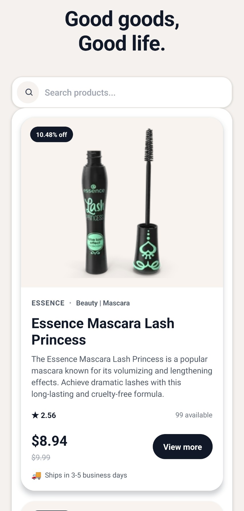
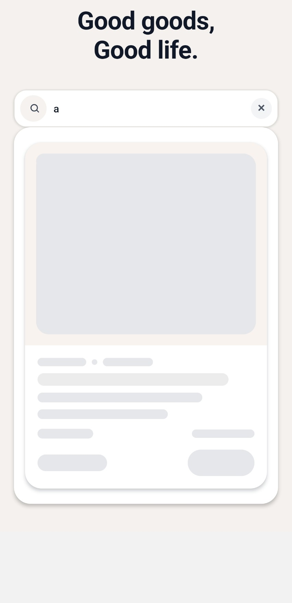
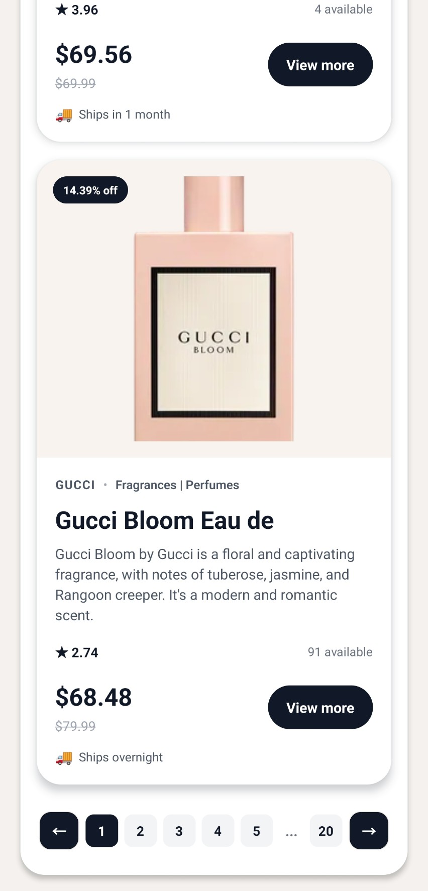
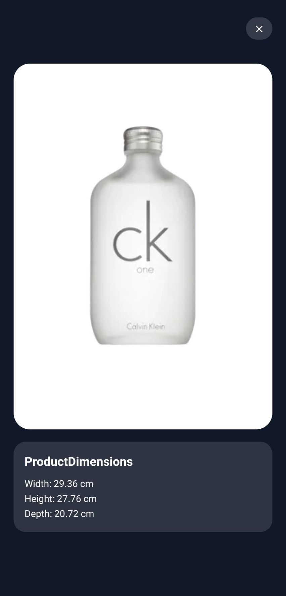
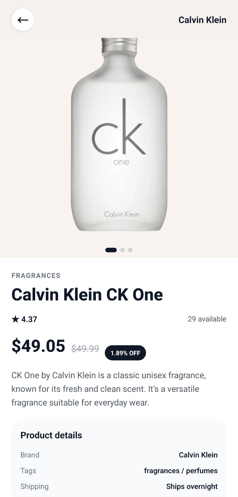
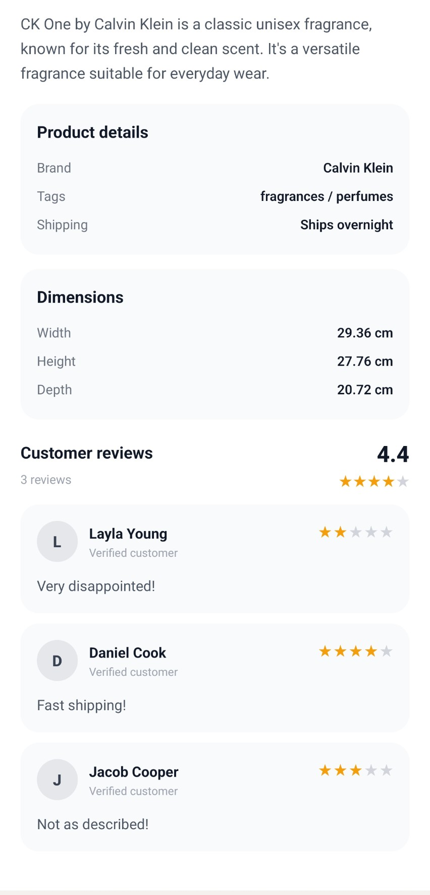

## video

[](./assets/walkthrough_video.mp4)

# Product Catalog App

A mobile-first product catalog built with Expo, React Native, and Expo Router. The app loads products from the DummyJSON API, supports pagination, search, image browsing, and a product detail view.

## Stack

- React Native
- Expo SDK 57
- Expo Router
- TypeScript
- DummyJSON public API
- Gluestack-inspired component primitives and custom UI wrappers

## Features

- Product grid with pagination
- Search by keyword
- Product detail page
- Swipeable product image gallery
- Product reviews section
- Responsive card-based layout
- Reusable UI components and skeleton loading states

## Project Structure

```
📂 product-catalog
├── 📂 src
│   ├── 📂 api // Handles product fetching to the DummyJSON API.
│   │   └── 📄 productApi.js
│   ├── 📂 app // Home catalog page.
│   │   ├── 📂 product
│   │   │   └── ⚛️ [id].tsx
│   │   ├── ⚛️ _layout.tsx
│   │   └── ⚛️ index.tsx
│   ├── 📂 components
│   │   ├── 📂 ui
│   │   │   ├── ⚛️ button.tsx
│   │   │   └── ⚛️ search.tsx
│   │   ├── ⚛️ pagination.tsx
│   │   ├── ⚛️ product-card.tsx
│   │   ├── ⚛️ product-reviews.tsx
│   │   └── ⚛️ product-skeleton.tsx
│   ├── 📂 models // Strongly typed product model.
│   │   ├── 📘 detail.ts
│   │   └── 📘 product.ts
│   └── 🎨 global.css
└── 📝 README.md
```

## How to Run

1. Install dependencies:

   ```bash
   npm install
   ```

2. Start the Expo development server:

   ```bash
   npx expo start
   ```

3. Open the app in one of the supported targets:

   - Expo Go on a physical device
   - Android emulator
   - iOS simulator
   - Web browser via the Expo web dashboard

4. Optional: run directly in web mode:

   ```bash
   npx expo start --web
   ```

## Install

- Scan this code with a device


Open the Camera app and point it at this code. Then tap the notification that appears.

- Send a link to a device

  Send and open the URL below to install it on a device.

  https://expo.dev/accounts/yyt-0901/projects/product-catalog/builds/f3007e2a-0ddb-4cce-89f3-79451195df1a

## Architecture Decisions

### 1. File-based routing with Expo Router
The app uses Expo Router instead of a custom navigation setup. This keeps the route structure aligned with the app feature flow: home page, product detail page, and shared layout conventions.

### 2. API layer separated from screens
Requests to DummyJSON are kept in a dedicated API module. Screens are responsible for rendering, while the API layer handles network logic and data contracts.

### 3. Strong typing for domain models
The app defines explicit TypeScript models for product list data and detail data so the code is easier to extend as the UI grows. This reduces API-shape friction and makes route/state development more predictable.

### 4. Reusable UI building blocks
Shared UI patterns such as buttons, search inputs, and skeleton loaders are encapsulated in reusable components under src/components. This keeps the screen code cleaner and makes consistency easier to maintain.

### 5. Product detail screen as a dedicated route
The detail view is a standalone route rather than inline content. This keeps concerns separated and matches a typical e-commerce app pattern where product detail pages are navigated from a catalog.

## Known Gaps / Not Finished

This app is a functional catalog prototype, but a few areas are intentionally left out or simplified:

- No user authentication or saved favorites persistence
- No advanced filtering or sorting beyond search
- No automated tests yet
- Some UI polish remains intentionally lightweight to keep the app simple and fast to iterate on

## AI Assistance Notes

This project was developed with AI support in several areas:

- Research: used to validate Expo Router patterns, API usage, and product detail flow design.
- Components UI: used to create reusable UI primitives such as search and button components.
- Bug discovery: used to diagnose runtime and TypeScript issues, including route typing and data-model mismatches.
- Components style generate: used to generate polished product-card, skeleton, and detail-page styling consistent with a modern e-commerce experience.

## Useful Commands

```bash
npm install
npx expo start
npx expo start --web
npm run reset-project
```

## Preview

|  |  |  |
| ------------------------------------------------------------ | ------------------------------------------------------------ | ------------------------------------------------------------ |
|  |  |  |

## License

This project is for learning and assessment purposes.
